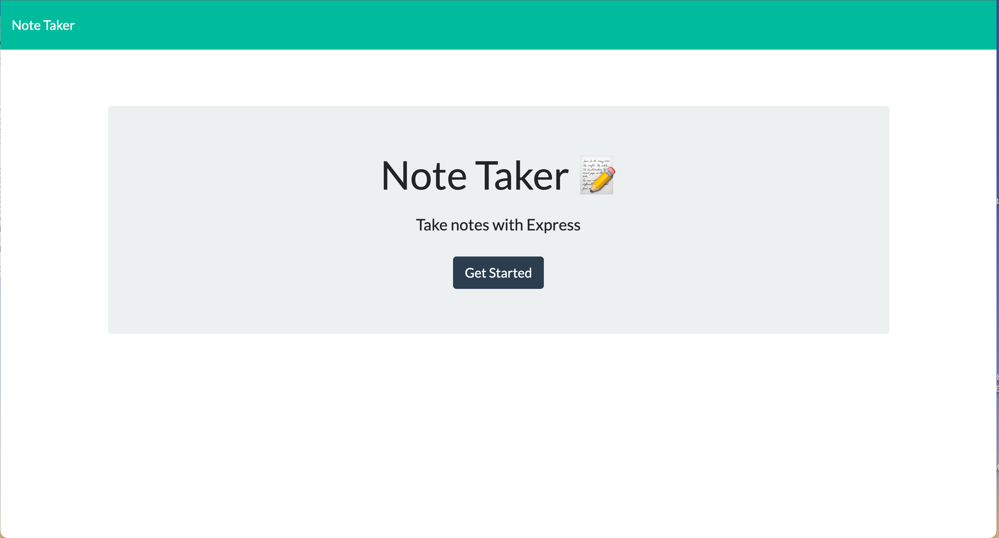
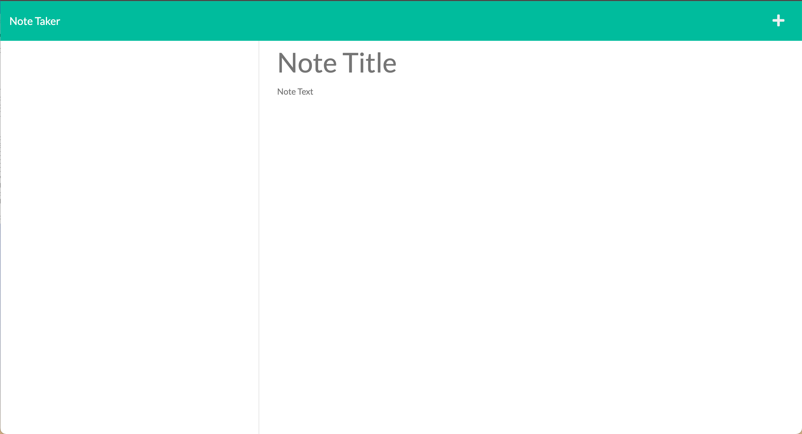

# Note Taker

## Concept 
  User accesses 'Note Taker' to write and save notes. 

```

User will open app, which will present them with a landing page.
User will press "Get Started" and user will be presented with a page for note taking.
User will write and save notes to stay organized and on track!

```

## Technology Used

- [Visual Studio Code](https://code.visualstudio.com/)
- [Node.js](https://nodejs.org/en/)
- [Express package](https://www.npmjs.com/package/express)
- [GitHub](https://www.github.com)
- [Heroku](https://www.heroku.com)


## Links
- [GitHub Repo](https://github.com/brittnc/NoteTaker)
- [Deployed App](https://rocky-island-00763.herokuapp.com/)

## Useage 
* Open Application

* Click "Get Started"

* Enter title of note, description of note

* Click save button at the top og the page


## Screenshots of Deplyed Application



## Questions
If you have any questions please reach out to my [E-mail!](brittneylynn@live.com)